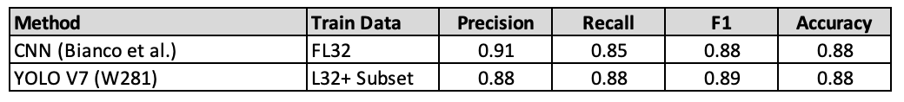

<!-- Add banner here -->

# W281 - Final Project : Logo Detection

<!--  -->

Authors: Luis Chion (lmchion@berkeley.edu), Eric Liu (eliu390@berkeley.edu), Viswanathan Thiagarajan (viswanathan@berkeley.edu), John Calzaretta (john.calzaretta@berkeley.edu)

Instructor: Allen Y. Yang

Date: 12/09/2022

---
<!-- Add buttons here -->

<!-- Describe your project in brief -->

<!-- The project title should be self explanotory and try not to make it a mouthful. (Although exceptions exist- **awesome-readme-writing-guide-for-open-source-projects** - would have been a cool name)

Add a cover/banner image for your README. **Why?** Because it easily **grabs people's attention** and it **looks cool**(*duh!obviously!*).

The best dimensions for the banner is **1280x650px**. You could also use this for social preview of your repo.

I personally use [**Canva**](https://www.canva.com/) for creating the banner images. All the basic stuff is **free**(*you won't need the pro version in most cases*).

There are endless badges that you could use in your projects. And they do depend on the project. Some of the ones that I commonly use in every projects are given below. 

I use [**Shields IO**](https://shields.io/) for making badges. It is a simple and easy to use tool that you can use for almost all your badge cravings. -->

<!-- Some badges that you could use -->

<!-- 
: This badge shows the version of the current release.

: I think it is self-explanatory. This gives people an idea about how the project is being maintained.

: This is a dynamic badge from [**Shields IO**](https://shields.io/) that tracks issues in your project and gets updated automatically. It gives the user an idea about the issues and they can just click the badge to view the issues.

: This is also a dynamic badge that tracks pull requests. This notifies the maintainers of the project when a new pull request comes.

: If you are not like me and your project gets a lot of downloads(*I envy you*) then you should have a badge that shows the number of downloads! This lets others know how **Awesome** your project is and is worth contributing to.

: This shows what kind of open-source license your project uses. This is good idea as it lets people know how they can use your project for themselves.

: This is not essential but it is a cool way to let others know about your project! Clicking this button automatically opens twitter and writes a tweet about your project and link to it. All the user has to do is to click tweet. Isn't that neat? -->

# Table of contents 

<!-- After you have introduced your project, it is a good idea to add a **Table of contents** or **TOC** as **cool** people say it. This would make it easier for people to navigate through your README and find exactly what they are looking for.

Here is a sample TOC(*wow! such cool!*) that is actually the TOC for this README. -->

- [W281 - Final Project : Logo Detection](#w281---final-project--logo-detection)
- [Table of contents](#table-of-contents)
- [Overview](#overview)
- [Related work](#related-work)
- [Dataset](#dataset)
- [Methods](#methods)
  - [Image Preprocessing](#image-preprocessing)
  - [Bag of Words SIFT (BoW SIFT)](#bag-of-words-sift-bow-sift)
  - [General Feature Extraction (GFE)](#general-feature-extraction-gfe)
    - [Shape](#shape)
    - [Color](#color)
    - [Texture](#texture)
  - [Mixed Models from Non-Learned Features](#mixed-models-from-non-learned-features)
  - [YOLO](#yolo)
- [Results and Discussion](#results-and-discussion)
  - [Overall Performance](#overall-performance)
  - [Class-Level Performance](#class-level-performance)
  - [Image-Level Error Analysis](#image-level-error-analysis)
  - [State of the Art Comparison](#state-of-the-art-comparison)
- [Challenges and Next Steps](#challenges-and-next-steps)
- [Appendix 1 : Additional YOLO Metrics](#appendix-1--additional-yolo-metrics)
- [References](#references)

<!-- - [Usage](#usage)
<!-- - [Dataset](#dataset)
<!-- - [Contribute](#contribute)
    - [Sponsor](#sponsor)
    - [Adding new features or fixing bugs](#adding-new-features-or-fixing-bugs)
<!--
 - [License](#license) -->
<!-- - [Footer](#footer) --> 

# Overview

These days brand logos can be found almost everywhere from images produced by IoT devices (cars and survellaince cameras) to social media postings (Facebook, Tiktok, Instagram).  As such, logo recognition is a fundamental problem for computer vision and can be used in the following applications:
- Copyright and Trademark compliance :  to detect patent infrigment by identifying logo patterns and colors from a well recognized brand
- Brand related statistics :  to understand consumer for targeted advertising.  Brand protection, recomendation and identification
- Intelligent traffic-control systems :  to recognize a specific symbol like stop or yield sign using camera feed from vehicles
- Document categorization : to detect logo appearing in documents and use it as a statement of ownership

Logo recognition can be considered a subset of object recognition.  In general, the majority of the logos are two dimensional objects containing stylized shapes, no texture and primary colors.  In some cases, logos can contain text (i.e. Fedex logo) or can be placed in different surfaces (i.e. Coca-Cola bottle or Adidas shoes).  The logo detection process can be split in two tasks:  determining the location of the logo (bounding box) and logo classification.  Finding the logo in a real world image is a challenging task.  It is desirable to have a incremental logo model learning without exhaustive manual labelling of increasing data expansion [[5]](#5). Also, logos can appear in highly diverse contexts, scales, changes in illumination, size, resolution, and perspectives [[6]](#6)

To prepare data for classification, we applied several pre-processing methods including Contrast Limited Adaptive Histogram Equalization (CLAHE) algorithm, data augmentation and class balancing.  

To classify logos, we built three 1-vs-all linear SVMs models and used a YOLO model :
1. Bag of Words SIFT.  This model was the standard prior 2015 and has good performance.
2. General Feature Extraction Model.  We referred to Choras et al.[[2]](#2) work to extract color, texture and shape features from images.
3. Mixed model with a combination of Bag of Words SIFT and General Feature Extraction Model
4. YOLO version 7.  Top performer among DL models for small and large datasets along with MFDNet and OSF-Logo.  Also, quite fast during training and detection.

For the manual models (1-3), we only concentrated on the second task of the logo detection process which is the classification algorithm.  Given that the complexity of techniques  to identify a logo in an image, we did not think it was feasible to complete the implementation within the course timeline.  We used the ground truth bounding boxes provided with the [Logos-32plus](http://www.ivl.disco.unimib.it/activities/logo-recognition/) dataset as our starting point. The bounding box coordinates were used for training both manual and YOLO models. The full image was used in YOLO model during inference without providing the bounding box coordinates. During inference in the manual model, the extracted bounding box was used for predictions.

   
<!-- Logos are persistent advertisements for a brand that may be mobile (printed on consumer goods) or immobile (storefront). In a streetview image of an area, visible logos potentially contain information about brand market share and the area's socioeconomic status. This idea can be combined with a rapidly growing resource: all kinds of devices that are equipped with cameras which constantly stream visual data to the cloud. Since this data can be automatically location-tagged, this is a rich data source for fraud detection, predicting consumer trends, or analyzing the socioeconomic status of an area based on logo type and frequency. This requires a computer vision algorithm that can identify unlabeled logos in a visual scene. -->

<!-- # Overview -->

<!-- Add a demo for your project -->

<!-- After you have written about your project, it is a good idea to have a demo/preview(**video/gif/screenshots** are good options) of your project so that people can know what to expect in your project. You could also add the demo in the previous section with the product description.

Here is a random GIF as a placeholder.

 -->

# Related work
<!-- [(Back to top)](#table-of-contents) --> 

In recent years, many datasets have been created to be used as quantitative and qualitative comparisons and benchmarking for logo detection[[5]](#5).  These sets vary in sizes and contain a realistic set of images with accurate ground truth annotations.  Datasets could vary quite a bit in the number of classes and images per class.  From FlickrLogos-32 with 32 classes and 2.2K images to PL8K with 8K classes and 3M images.  FlickrLogos-32 comprises of images from the real world, and many contain occlusions, apearance changes, and lighting changes.  Large datasets such as PL8K have greater class imbalance since images are collected semi-programatically.  The images in PL8K span across different enterprises, namely Clothing, Food, Transportation, Electronics, Necessities, Leisure, Medicine, Sports and Others.  

Table.1 - Statistics of existing logo detection datasets

Prior 2015, logo recognition has used keypoint-based detectors and descriptions such as Bag of quantized SIFT features (BofW SIFT) and Histogram of Gradients (HOG) [[1]](#1).  BofW SIFT is a method in which a histogram of visual words are created by bucketing SIFT keypoints using Kmeans clustering algorithm to create the visual words.   After this, 1-vs-all linear classifier like SVM is used for logo recognition. In addition to BoW SIFT, Romberg and Lienhart [[3]](#3) use a feature bundling technique where individual local features are aggregated with features with their spatial neighborhood into bundles.  Also, Romberg et al [[3]](#3) propose to index the relative spatial layout of local features on logo regions by means of a cascaded index.  

Choras et al. [[2]](#2) use general features extraction methods that are application independent such as color, texture, and shape.  These features can be further divided into pixel-level features such as color and location, local features as a result of subdivision of the image band in segments or edges, global features over the entire image or sub-area.  To represent color features, the author uses color moments (mean, variance, skewness) extracted from RGB, HSV and YCrCb color histograms.  Texture is also a powerful descriptor but on its own may not have the capability of finding objects.  Texture can be calculated using different methods such as Fourier power spectra, co-ocurrence matrices, SPCA, Tamura features, and Wold decomposition.  Next, Shape is one of the primitive features for image content description but measuring is difficult.   Shape methods can be divided in region and contour based. While Region-based use the whole area, Contour-based use only info from the contours of an object.
For classification, lower order moments are calculated to extract Shape features.  The most common moments are geometrical, central, moment invariants, Zernike moments, Hu moments and Legendre moments.

In recent reasearch, deep learning has emerged as the default standard for logo detection.  Deep learning models are classified into 4 categories: Convolutional Neural Network models, YOLO-based models, Single Shot Detector-based models and Feature Pyramid Network-based models.  
1. R-CNN is a typical proposals-based approach but it is slow in detecting objects due to its Selective Search (SS) algorithm.  To overcome this, a Faster R-CNN algo was proposed that uses region proposal network (RPN) to generate region proposals.  
2. In contrast to R-CNN, YOLO proposes the use of an end-to-end neural network that makes prediction of bounding boxes and class probabilities all in one single stage.  At a high level, YOlO divides the images into N grids of dimension SxS.  These grids predict the bounding boxes along with the labels and the probability of the object being present in a cell.  YOLO uses Non Maximal Supression method to exclude the bounding boxes with lower probability scores.  
3. Single Shot Detector-based models (SSD) uses multi-scale feature maps to detect objects at different scales. It is comparable to YOLO in that it takes only one shot to detect multiple objects present in an image using multibox. Outperforms a comparable state-of-the-art Faster R-CNN and is widely used in vehicle logo detection.
4. Feature Pyramid Network (FPN) uses a multiple feature map layers similar to SSD.  It is composed of two pathways: bottom-up and top-down.  The bottom-up is the usual convolutional network for feature extraction.  As we go up on the layer, the spatial resolution decreases but the semantic value increases.  In comparison, SSD only uses top layers of bottom-up pathway for prediction whereas FPN provides a top-down pathway to construct higher resolution layers from a semantic rich layer.

The tables below show State-Of-The-Art Mean Average Precisions (mAP) for small, medium, and large datasets.  We can observe that mAP decreases with the size of dataset.  Interestingly, for medium and small datasets, Scaled YOLOv4 performs better than the more conventional Faster R-CNN.

    <table>
         <tr>
    	      <td style="padding:10px">
        	    Small dataset performance (FlickrLogos-32)
      	    </td>
            <td style="padding:8px">
            	Medium dataset performance (QMUL-OpenLogo)
            </td>
            <td style="padding:8px">
            	Large dataset performance (Open Brands)
            </td>
        </tr>
        <tr>
    	      <td style="padding:10px">
        	    
      	    </td>
            <td style="padding:8px">
            	
            </td>
            <td style="padding:8px">
            	
            </td>
        </tr>
    </table>

Robust and accurate detection is still difficult.  Logos tend to be small in size and maybe difficult to detect them in complex backgrounds (i.e. logo sign on a busy street).  The backgrounds can be very diverse in nature.  Logos can be on bottles, shirts, cars, billboards and can be of different textures (i.e. nike logo in shoes and clothes).  Sub-branding detection can impose additional difficulties when there are subtle differences between parent brands and sub-brands (i.e. coca-cola and diet coke).   There is still plenty of work to do to improve logo detection.  Higher resolution feature maps have been used with sucess but it is computationally very expensive and too slow for real-time applications.

Some future research directions include:  Lightweight logo detection to reduce model complexity while mantaining the same accuracy. Weekly supervised logo detection to automate the annotation not only reduces the cost but also improves the generalization and robustness of the model.  Video logo detection which provides more information to businesses by adding correlation between consecutive images.  Tiny logo detection with not enough pixel information for recognition.  Long tail logo detection for growing small businesses where you cannot find enough image samples.  Incremental logo detection where we assume an open dataset where new logo and logo variations emerge every day.

<!-- *You might have noticed the **Back to top** button(if not, please notice, it's right there!). This is a good idea because it makes your README **easy to navigate.*** 

The first one should be how to install(how to generally use your project or set-up for editing in their machine).

This should give the users a concrete idea with instructions on how they can use your project repo with all the steps.

Following this steps, **they should be able to run this in their device.**

A method I use is after completing the README, I go through the instructions from scratch and check if it is working. -->

<!-- Here is a sample instruction:-->

# Dataset

[Logos-32plus](http://www.ivl.disco.unimib.it/activities/logo-recognition/) is a collection of 12,312 real-world photos that contain 32 different logo classes. It is an expansion on the the [FlickrLogos-32 dataset](https://www.uni-augsburg.de/en/fakultaet/fai/informatik/prof/mmc/research/datensatze/flickrlogos/).  Both has the same classes of objects but Logos-32plus has substantially more images.  Logos-32plus is designed to be more representative of the various conditions that logos appear in and more suitable for training keypoint-based approaches to logo recognition. Logos appear in high contrast on approximately planar or cylindrical surfaces with varying degrees of obstruction. To construct this dataset, images were scraped from Flickr and Google Images through a text-based search on image tags by the owners.  To increase variability in the data distribution, different queries were put together by concatenating a noun plus the logo name (i.e. "merchandising Becks", "can Becks", "drink Becks"). Scraped images were manually filtered by the owners to remove unfocused, blurred, noisy, or duplicate images [1].

We selected 10 logo classes and corresponding images from the Logos-32plus dataset to use in our project for training and evaluation. Each image in this dataset is labeled with a single class, and the 10 classes each contain 300 photos on average. Bounding box annotations are provided for each occurrence of a logo in an image; photos may have one or multiple instances of the logo corresponding to the labeled class. In cases where an image contains logos belonging to multiple classes, only logos corresponding to the image class are annotated. The distribution of images and bounding boxes per class are shown in Fig. 1. Note that bounding box counts are significantly larger than image counts due to images containing multiple occurrences of a logo.

Fig.1 - Distribution of logo images and bounding boxes per class

<!-- [(Back to top)](#table-of-contents)  --> 

<!-- This is optional and it is used to give the user info on how to use the project after installation. This could be added in the Installation section also. -->

# Methods
<!-- [(Back to top)](#table-of-contents) -->

<!-- This is the place where you give instructions to developers on how to modify the code.

You could give **instructions in depth** of **how the code works** and how everything is put together.

You could also give specific instructions to how they can setup their development environment.

Ideally, you should keep the README simple. If you need to add more complex explanations, use a wiki. Check out [this wiki](https://github.com/navendu-pottekkat/nsfw-filter/wiki) for inspiration. -->

Non-deep learning methods to logo prediction typically involve two approaches. The first one is logo localization, which identifies potential locations in an image where a logo may be present. This can be solved by using a correlation tracker to detect image regions that have high correlation with a mask image. Multiple mask images are produced from each logo via affine transformation, rotation, and resizing. Regions that produce a sufficiently high correlation with any mask image are annotated with a bounding box and the class of the mask image. The second one is logo classification, which uses a feature-based model to perform image recognition on the bounding boxes produced by a logo localization model or a matching algorithm. Since the Logos-32plus dataset provides ground truth bounding boxes for all images, this project assumes a strongly-labeled dataset as input and focuses only on the logo classification problem within the bounding box.

Based on the literature review and the performance of YOLOv4 compared to R-CNN for this type of problem we selected YOLO. The YOLO deep learning model takes entire images with annotations as input, while our manual classification model takes labeled bounding boxes as input. The train-validation-test split is applied at the image level before preprocessing. We apply a 70-15-15 train-validation-test split in order to maximize the size of the validation and test sets to increase the generalization and robustness of the model. 

## Image Preprocessing

Using the ground truth bounding boxes provided by the Logos-32plus dataset, all bounding boxes are extracted from each image. Each bounding box is now considered a unique logo image that belongs to the same class and data split as the source image. Image contrast normalization is performed on by applying the Contrast Limited Adaptive Histogram Equalization (CLAHE) algorithm with 4x4 tile size to the luminance channel of each image. Example output of this step is shown in Fig. 2. Data augmentation generates additional training examples from a single image by applying random 3D rotation transformations and color inversions. Class balancing is enforced by adjusting the number of generated images such that the final image counts are uniform. The total number of images after data augmentation is abcdefg.

Fig.2 - Data Augmentation Example using Adidas image

## Bag of Words SIFT (BoW SIFT)

Our dataset consists of real world photos with different logos in them. The logos found in the images are having different colors, scales, illumination, rotations, local affine distortions and partial occlusion. One of the features that could work well with our classification task is SIFT (Scale-invariant feature transform). We selected SIFT for the manual model as it is rotation and scale invariant and has the potential to work well when compared to other existing descriptors when there are distortions as described above in the dataset.

SIFT or Scale Invariant Feature Transform is a feature detection algorithm in Computer Vision.  SIFT locates features in an image, known as "keypoints".  Keypoints are scale, noise, illumination and rotation invariant.  Another important characteristic is that the relative position between the features does not change from one image to another.  Each keypoint is a 128-dimensional feature descriptor (when 1 layer is used). A vocabulary is formed by sampling features (or keypoints) from the training set and clustering them using K-means algorithm.  This process partitions 128 dimensional SIFT features space into N number of regions and allow us to create histograms of visual words. After that, the SIFT histogram get normalized and a classification model is trained using SVM or Logistic Regression. A detailed description of how SIFT was implemented is described below. 

Fig.3 - Bag of Words SIFT diagram from https://heraqi.blogspot.com/2017/03/BoW.html

The step by step implementation of SIFT and classification algorithms on the logos dataset can be accessed from this [notebook](https://github.com/jcalz23/logo_detection_w281/blob/main/SIFT_Histogram_Models_Full_and_BB.ipynb). The notebook has two sections. In the first section, the logos were extracted from the images using manual coordinates and processed through SIFT feature extraction, histogram build, and training with no data pre-processing. In the second section the input bounding boxes used were already pre-processed and augmented on which SIFT features extraction, histogram build, and training was performed. In both sections the images used were grayscale.

## General Feature Extraction (GFE)

Along with the BoW SIFT features, additional non-learned features were extracted from the image bounding boxes, these include: shape, color and texture feautures. The motivation is to understand if model performance improves when fit on BoW SIFT and additional features.  

### Shape 

Image moments are used to describe the shape of an object in an image.  These moments are described in the 1962's Ming-Kuei paper [[3]](#3) and capture information like the are of the object, the centroid and the orientation.  Hu moments should not be used in situations where there is noise, occlusion or a lack of clean segmentation since it is very hard to get a dependable and repeatable centroid. Hu moments are invariant to translation, scale, rotation and reflection.  To calculate Hu moments, we first used Canny to calculate the edges of a log with threshold 1 and 2 set to 100 and 200 respectively.  After, Hu moments are calculated as follows:

The regular moment of a shape in a binary image is defined by:

where I (x, y)  is the pixel intensity value at the (x ,y)-coordinate.

In order to obtain translation invariance, we need to take our shape measurements relative to the centroid of the shape. The centroid is simply the center(x ,y)-coordinates of the shape, which we define as x– and y– respectively.

With the centroids, we can compute relative moments which are centered about the centroid:

These relative moments do not have much discriminative power to represent shapes, nor do they posses any invariant properties. To solve that, Hu took these relative moments and constructed 7 separate moments which are suitable for shape discrimination:

### Color 
Color features are advantageous in image classification as they are robust to rotation, simple to compute, and require minimal storage. Color features can be effective in the logo domain as many brand logos use consistent color schemes the majority of the time. However, a key challenge is presented when a brand uses several different color schemes for a single logo. For example, the classic Coca Cola can is known for its red and white color scheme, but the Coca Cola Zero product uses black and red coloring.

When extracting color features, the standard approach is to build a color histogram to represent an image. Given a color histogram, color moments are an effective way to condense the representation. For each image and color model (RGB, HSV, YCrCB), we extract the first (mean), second (variance) and third order (skewness) color moments, thus resulting in nine color moment features per image. 

For each color component *k*, the first color moment is defined by

where the color of the pixel (*x, y*) is represented by *fk(x, y)*. For the second and third moments (*h = 2, 3*), each color component *k* is defined as 

### Texture
Texture is another important property of a logo; while it does not uniquely describe a logo, it may help differentiate textured logos from non-textures ones. For example, FedEx logos are typically found in print (plastic) or on vehicle decals (metal), and Adidas logos are frequently found on clothing and shoes (cotton, leather).

A statistical approach to generating texture features uses a gray level co-occurrence matrix, which is a histogram of co-occurring grayscale values (i, j) at a given distance d (defined in polar coordinates) over an image. The co-occurrence matrix C(i, j) is defined by

where card indicates the number of elements in the set. 

A set of features can be extracted from the co-occurrence matrix to reduce the dimensionality of the feature space. Figure 3 captures the set of features extracted from C(i,j)

Fig.3 - Formulas for Texture Features from Co-Occurrence Matrix (from **CITE PAPER**) 

The implementation of these non-learned features can be found in [general_feature_extraction.ipynb](./general_feature_extraction.ipynb).

## Mixed Models from Non-Learned Features
With the non-learned features described above, we fit a set of models on each of three feature sets: BoW SIFT only, GFE only (shape, color texture), and the combination of BoW SIFT and GFE. The goal of this exercise is to understand how effective each of the feature sets are alone, and if any performance lift is achieved by training on them jointly. 

For each feature set explored, we selected Support Vector Machine algorithm for classification based on Romberg et al work. The validation set was used to tune the hyperparameters of each model. The model configurations are displayed in Table 1 below.

Table 1 - Top Model Configuration per Feature Set

The implementation and evaluation of each model in Table 1 can be found in [gfe_modeling.ipynb](./gfe_modeling.ipynb). The results of each model are displayed and discussed in the results section.

## YOLO
YOLO is a deep learning algo for real-time object detection.  It is capable not only to provide the exact location of an object in an image (bounding boxes) but also able to identify it (classification).  It uses a combination of approaches such as fast R-CNN, Retina-Net and Single-Shot MultiBox DEtector (SSD).  YOLO has become the standard in object recognition due to its speed, detection accuracy, good generalization and the fact that is open-source.

In preparation for the training, we loaded 3,062 groundtruth images into Roboflow using the same train test validation partition (70%-15%-15%). After uploading, images were auto oriented so images are display using the correct EXIF orientation stored in the metadata.  Also, images are resized to 640x640 pixels to improve training performance.  No further data augmentations were applied.

For training YOLO, we used a batch size of 16 and we ran 300 epochs as recommended in  [Tips for Best Training Results Documentation](https://docs.ultralytics.com/tutorials/training-tips-best-results/).  For testing, we set our confidence and IOU threshold equal to 50%. 

<!-- Here are the results of YOLOv7 Test dataset:

|  Class        |  Labels     |      P    |       R  |    mAP@.5 | mAP@.5:.95|
| :---            |    :----:   |         :----:  |        :----: |   :----: |   :----: |
|  all          |     677     |   0.88    |   0.885   |    0.881   |    0.701 |
|  adidas       |          28  |     0.807   |    0.786  |     0.788  |     0.632 |
|  apple        |         82   |    0.926   |    0.919  |     0.923   |    0.681  |
|  bmw          |       81    |   0.862   |    0.975   |    0.947   |    0.787 |
|  cocacola     |            71 |      0.625  |     0.774  |     0.725  |     0.431 |
|  dhl          |        88     |  0.941    |   0.905     |  0.961    |   0.741 |
|  fedex        |         81    |   0.949   |    0.988    |   0.989   |    0.801 |
|  heineken     |         31    |   0.899   |    0.774   |    0.797  |     0.682 |
|  pepsi        |     100    |   0.911   |    0.818   |    0.787   |    0.592 |
|  starbucks    |          79  |     0.905  |     0.975  |     0.976    |   0.903 |
|  ups          |       36    |   0.971  |     0.938  |     0.922   |    0.756 |

 -->

The step by step implementation of YOLO can be found in [Yolov5.ipynb](./Yolov5.ipynb). These notebooks came from [Roboflow's Blog: How to Train YOLOv7 on a Custom Dataset](https://blog.roboflow.com/yolov7-custom-dataset-training-tutorial/).  It shows step by step how to download the dataset, custom train and run evaluations.

# Results and Discussion
In this section, we first summarize and compare the performance of each model form as defined above. Next, we discuss the performance of each model form in greater detail by looking at class-level performance. Finally, we examine specific images that were not predicted correctly by the top performing model to better understand the model’s faults and areas of potential improvement.

## Overall Performance
Table 2 compares the performance of the YOLO model to the different GFE models trained on non-learned features.

|  Model Name   | Model Form | Feature Set                     | Accuracy | Precision | Recall | F1   |
| :---          |    :----   |   :----                         |  :----:  |  :----:   | :----: |:----:|
|YOLO V7        |   YOLO V7  |Learned by Model                 |   0.88*  |   0.88    |  0.89  | 0.88 |
|Mixed SIFT + GFE| SVM       |BoW SIFT + Shape, Color, Texture |   0.89   |   0.88    |  0.87  | 0.88 |
|BoW SIFT        | SVM       |BoW SIFT                         |   0.80   |   0.80    |  0.81  | 0.80 |
|GFE Model       | SVM       |Shape, Color, Texture            |   0.79   |   0.75    |  0.74  | 0.74 |

**Table 2 - Comparison of model performance**
***YOLO models use mAP@0.5 for accuracy metric**

It was expected that the YOLO model would be a strong performer as it is known to deliver state of the art results across many image classification tasks. Whereas the GFE models are fit on deterministic features extracted from images, the YOLO model is able to learn abstract features in fine tuning that apply specifically to the logo domain. However, the Mixed GFE model is competitive with YOLO, which highlights the signal provided by the BoW SIFT and other non-learned features.

The top performing model that uses only non-learned features is the Mixed GFE model which was comparable to YOLO performance. We hypothesized that the BoW SIFT features alone would deliver the top performance; however, the additional non-learned features provided additional signal. The union of all non-learned features makes the model more complex and the fact that improved performance tells us that the SIFT model is not complex enough and underfit the data. It is important to keep in mind that BoW SIFT Bag of visual words were limited by compute constraints and could have increased complexity itself with more than 1500 words, aside from the other GFE features.

## Class-Level Performance
In multi-class classification problems, it is crucial to understand the model performance across classes, rather than just the aggregate measures. Table 3 shows the class-level performances of the YOLO, Mixed GFE, and BoW SIFT models.

| Class | YOLO V7 | Mixed GFE + SIFT | BoW SIFT |
| :---  | :----|:----:|:----:|
| Adidas| 0.79 | 0.67 | 0.63 |
| Apple | 0.92 | 0.79 | 0.66 |
| BMW   | 0.95 | 0.90 | 0.85 |
| Coca cola | 0.73 | 0.85 | 0.76 |
| DHL   | 0.96 | 0.96 | 0.83 |
| FedEx | 0.99 | 0.90 | 0.89 |
| Heineken | 0.80 | 0.89 | 0.85 |
| Pepsi | 0.79 | 0.90 | 0.70 |
| Starbucks | 0.98 | 0.98 | 0.98 |
| UPS   | 0.92 | 0.93 | 0.86 |

**Table 3 - Comparison of F1 score per class across models**

Looking across logo classes and models, there are some classes that each model does well on, and some with which each model struggles. Each model has a strong F1 score for Starbucks, UPS and Fedex classes; UPS and Fedex are both text based logos with distinct edges, while Starbucks is highly distinct and likely easier for models to differentiate. Adidas and Coca Cola have F1-scores mostly below or near 0.8 for each model; this could be due to the fact that these two brands have greater diversity in the appearance of logos across different images and have larger homogeneous area.

Comparing YOLO to the Mixed GFE & Sift model, YOLO performs markedly better for Apple and BMW, and markedly worse for Coca Cola, Heineken and Pepsi. One explanation could be that the former classes are often found on flat surfaces, and the latter are all drinks which are typically found on curved surfaces. Additionally, research has shown that YOLO models perform well on smaller objects and in low contrast environments, which apply closely to Apple and BMW [8].

Comparing the Mixed GFE & SIFT model to the SIFT model, the Mixed model provides strong lift in each of the classes with which the BoW SIFT struggles most: Apple, BMW, and Pepsi. One explanation could be that each of these logos have few corners and thus SIFT might struggle to consistently identify keypoints. The color, shape and texture features add more signal when detecting keypoints in the logos that are less consistent. The remainder of classes are roughly comparable, with the Mixed model slightly outperforming the SIFT model.

## Image-Level Error Analysis
For the top performing YOLO V7 model, we picked out several examples of misclassified test images to further understand the limitations and weaknesses of the model. This exercise showed that the YOLO model made mistakes more frequently in cases with small, blurry, and occluded images as well as cases of unusual logos that deviate from the common case (such as the Heineken pint image).

<!-- :-------------------------:|:-------------------------:  |:-------------------------: |:-------------------------: |
  |    |     |     |
  |    |     |     | -->

    <table>
       <tr>
    	      <td style="padding:10px">
        	    Undetected PEPSI with blur
      	    </td>
            <td style="padding:10px">
            	Detected partial Starbucks
            </td>
            <td style="padding:10px">
            	Shouldn't have detected as Coca-Cola
            </td>
            <td style="padding:10px">
            	Not detected small BMW
            </td>
        </tr>
	    <tr>
    	      <td style="padding:10px">
        	    
      	    </td>
            <td style="padding:10px">
            	
            </td>
            <td style="padding:10px">
            	
            </td>
            <td style="padding:10px">
            	
            </td>
        </tr>
        <tr>
    	      <td style="padding:10px">
        	    Undetected small Heineken sign
      	    </td>
            <td style="padding:10px">
            	Shouldn't have detected as Heineken
            </td>
            <td style="padding:10px">
            	Not detected different Heineken logos
            </td>
            <td style="padding:10px">
            	Not detected warped Coca-Cola
            </td>
        </tr>
        <tr>
    	      <td style="padding:10px">
        	    
      	    </td>
            <td style="padding:10px">
            	
            </td>
            <td style="padding:10px">
            	
            </td>
            <td style="padding:10px">
            	
            </td>
        </tr>
    </table>

## State of the Art Comparison
As mentioned in the Data section, our models are developed on a subset of classes in the Logos32+ dataset (due to compute constraints) and also do not include a background class. Though not an apples-to-apples comparison due to dataset differences, Figures 7 and 8 place our models in the context of the literature that inspired them.

Fig. 7 - Comparison with BoW SIFT in Romberg et al. [3]

Fig. 8 - Comparison with CNN in Bianco et al. [1]

The BoW SIFT model fit on FlickrLogos-32 dataset in Romberg et al. achieves much higher performance than our BoW SIFT fit on the subset of classes in Logos32+. The CNN model fit on FlickrLogos-32 dataset in Bianco et al. only slightly outperforms our YOLO model fit on the subset of classes in Logos32+ in terms of precision. A direct comparison is challenging without fitting our models on the same data; however, we hypothesize that differences can be primarily attributed to our model working with a subset of classes, not including a background class, and not utilizing data augmentation. 

# Challenges and Next Steps
During the data pre-processing, augmentation and the model building phases we encountered a few challenges which are listed below:

* The Logos 32 plus dataset consists of 32 classes. We had to reduce the selection to 10 classes to keep data processing and training manageable.
* A SIFT Bag-of-visual-words histogram model was used during training. As we increased the number of bins/clusters for the descriptors, the model continued to show improved performance on the validation set. We hit computing capacity before we could further increase complexity and validate the model.
* Contrast Limited AHE (CLAHE) was used to reduce this problem of noise amplification. Due to the use of a smaller kernel in this step, keypoints increased by 3.5 times per image. This caused severe performance bottle necks while running the k-means algorithm to create SIFT Bag-of-visual-words.
* Extracting SIFT keypoints from some of the homogeneous logo images were challenging and no keypoints were detected in some cases. These have been excluded during both training and validation.
* Handling same brand logos with different color schemes, mirror images and textures on different surfaces.

As an extension to this project, we have identified a few next steps:

* Build a classification model that includes all 32 classes
* Perform Contrast Limited AHE with a larger kernel limiting the contrast amplification and the noisy details
* Perform data augmentation for the training similar to the Bianco et al. paper[1]
* Use 2 layers in SIFT with 160 dimension keypoint descriptors
* Increase complexity of the Mixed model by introducing additional features into the model
* Execute Yolo algorithm on the dataset by enabling data augmentation options 

# Appendix 1 : Additional YOLO metrics

YOLOv7 Test Confusion Matrix

YOLOv7 Test PR Curve

YOLOv7 Test F1 Curve

YOLOv7 Test P Curve

YOLOv7 Test R Curve

# References 

<a id="1">[1]</a> 
Simone Bianco, Marco Buzzelli, Davide Mazzini and Raimondo Schettini (2017).
Deep Learning for Logo Recognition. Neurocomputing.
https://doi.org/10.1016/j.neucom.2017.03.051

<a id="2">[2]</a> 
Choras, Ryszard S.. (2007). Image feature extraction techniques and their applications for CBIR and biometrics systems. 
International Journal of Biology and Biomedical Engineering.  
https://www.researchgate.net/publication/228711889_Image_feature_extraction_techniques_and_their_applications_for_CBIR_and_biometrics_systems

<a id="3">[3]</a> 
Stefan Romberg and Rainer Lienhart. 2013. Bundle min-hashing for logo recognition. In Proceedings of the 3rd ACM conference on International conference on multimedia retrieval (ICMR '13). Association for Computing Machinery, New York, NY, USA, 113–120. https://doi.org/10.1145/2461466.2461486

<a id="4">[4]</a> 
Romberg, Stefan & Pueyo, Lluis & Lienhart, Rainer & Zwol, Roelof. (2011). Scalable logo recognition in real-world images. 25. 10.1145/1991996.1992021. https://dl.acm.org/doi/10.1145/1991996.1992021

<a id="5">[5]</a> 
Hou, S., Li, J., Min, W., Hou, Q., Zhao, Y., Zheng, Y., & Jiang, S. (2022). Deep Learning for Logo Detection: A Survey. ArXiv, abs/2210.04399. https://arxiv.org/abs/2210.04399

<a id="6">[6]</a> 
C. Li, I. Fehérvári, X. Zhao, I. Macedo and S. Appalaraju, "SeeTek: Very Large-Scale Open-set Logo Recognition with Text-Aware Metric Learning," 2022 IEEE/CVF Winter Conference on Applications of Computer Vision (WACV), 2022, pp. 587-596, doi: 10.1109/WACV51458.2022.00066. https://ieeexplore.ieee.org/document/9706752

<a id="7">[7]</a> 
H. Su, S. Gong and X. Zhu, "WebLogo-2M: Scalable Logo Detection by Deep Learning from the Web," 2017 IEEE International Conference on Computer Vision Workshops (ICCVW), 2017, pp. 270-279, doi: 10.1109/ICCVW.2017.41. https://ieeexplore.ieee.org/abstract/document/8265251

<a id="8">[8]</a> 
Shuo Yang, Junxing Zhang, Chunjuan Bo, Meng Wang, Lijun Chen (2018). "Fast vehicle logo detection in complex scenes," Optics & Laser Technology Volume 110, 2019, pp.196-210, doi: 10.1016/j.optlastec.2018.08.007. https://www.sciencedirect.com/science/article/abs/pii/S0030399218310715

<a id="9">[9]</a> 
Ming-Kuei Hu, "Visual pattern recognition by moment invariants," in IRE Transactions on Information Theory, vol. 8, no. 2, pp. 179-187, February 1962, doi: 10.1109/TIT.1962.1057692.

<!-- 

 -->

<!--# Contribute
[(Back to top)](#table-of-contents)-->

<!-- This is where you can let people know how they can **contribute** to your project. Some of the ways are given below.

Also this shows how you can add subsections within a section. -->

<!--### Sponsor
[(Back to top)](#table-of-contents)-->

<!-- Your project is gaining traction and it is being used by thousands of people(***with this README there will be even more***). Now it would be a good time to look for people or organisations to sponsor your project. This could be because you are not generating any revenue from your project and you require money for keeping the project alive.

You could add how people can sponsor your project in this section. Add your patreon or GitHub sponsor link here for easy access.

A good idea is to also display the sponsors with their organisation logos or badges to show them your love!(*Someday I will get a sponsor and I can show my love*) -->

<!--### Adding new features or fixing bugs
[(Back to top)](#table-of-contents) -->

<!-- This is to give people an idea how they can raise issues or feature requests in your projects. 

You could also give guidelines for submitting and issue or a pull request to your project.

Personally and by standard, you should use a [issue template](https://github.com/navendu-pottekkat/nsfw-filter/blob/master/ISSUE_TEMPLATE.md) and a [pull request template](https://github.com/navendu-pottekkat/nsfw-filter/blob/master/PULL_REQ_TEMPLATE.md)(click for examples) so that when a user opens a new issue they could easily format it as per your project guidelines.

You could also add contact details for people to get in touch with you regarding your project. -->

<!--# License
[(Back to top)](#table-of-contents)-->

<!-- Adding the license to README is a good practice so that people can easily refer to it.

Make sure you have added a LICENSE file in your project folder. **Shortcut:** Click add new file in your root of your repo in GitHub > Set file name to LICENSE > GitHub shows LICENSE templates > Choose the one that best suits your project!

I personally add the name of the license and provide a link to it like below. -->

<!--[GNU General Public License version 3](https://opensource.org/licenses/GPL-3.0) -->

<!--# Footer
[(Back to top)](#table-of-contents) -->

<!-- Let's also add a footer because I love footers and also you **can** use this to convey important info.

Let's make it an image because by now you have realised that multimedia in images == cool(*please notice the subtle programming joke). -->

<!-- Leave a star in GitHub, give a clap in Medium and share this guide if you found this helpful. -->

<!-- Add the footer here -->

<!--  -->

